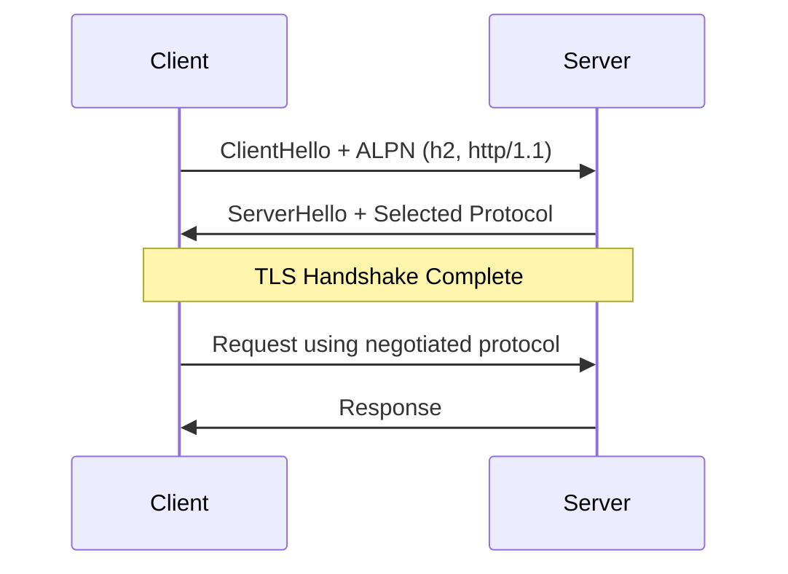
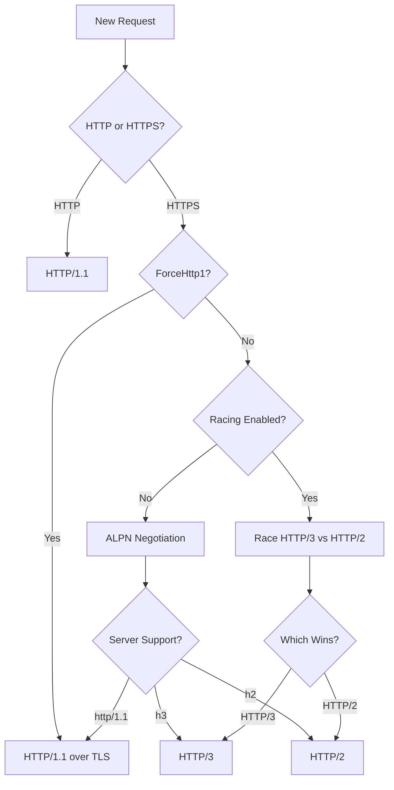

## Protocol support overview

The TLS Client library provides full support for all modern HTTP protocols:

- **HTTP/1.1** - Traditional text-based protocol, widely compatible
- **HTTP/2** - Binary protocol with multiplexing, the current standard
- **HTTP/3** - QUIC-based protocol using UDP, the future of HTTP

<Info>
The library automatically selects the optimal protocol through ALPN (Application-Layer Protocol Negotiation) during the TLS handshake.
</Info>

## Protocol negotiation

When establishing a connection, the client and server negotiate which protocol to use:



### ALPN extension

The TLS handshake includes an ALPN extension listing supported protocols:

```go
&tls.ALPNExtension{AlpnProtocols: []string{
    "h2",        // HTTP/2
    "http/1.1",  // HTTP/1.1
}}
```

The server selects the first protocol it supports from the list, typically preferring HTTP/2 over HTTP/1.1.

<Note>
HTTP/3 uses a different discovery mechanism through Alt-Svc headers, as it runs over QUIC/UDP rather than TCP.
</Note>

## HTTP/1.1

HTTP/1.1 is the fallback protocol, supported by all servers.

### Characteristics

- Text-based protocol over TCP
- One request per connection (or sequential with keep-alive)
- Simple request/response model
- Header compression via gzip/deflate

### When HTTP/1.1 is used

The library falls back to HTTP/1.1 when:

- The server doesn't support HTTP/2
- Connecting over plain HTTP (not HTTPS)
- You explicitly force HTTP/1.1

```go
client, err := tls_client.NewHttpClient(tls_client.NewNoopLogger(),
    tls_client.WithClientProfile(profiles.Chrome_146),
    tls_client.WithForceHttp1(), // Force HTTP/1.1
)
```

### Implementation

HTTP/1.1 transport is built in [`roundtripper.go:438`](https://github.com/bogdanfinn/tls-client/blob/master/roundtripper.go#L438):

```go
func (rt *roundTripper) buildHttp1Transport() *http.Transport {
    t := &http.Transport{
        DialContext:    rt.dial,
        DialTLSContext: rt.dialTLS,
        TLSClientConfig: utlsConfig,
        ConnectionFlow: rt.connectionFlow,
        IdleConnTimeout: idleConnectionTimeout,
    }
    
    if rt.transportOptions != nil {
        t.DisableKeepAlives = rt.transportOptions.DisableKeepAlives
        t.DisableCompression = rt.transportOptions.DisableCompression
        t.MaxIdleConns = rt.transportOptions.MaxIdleConns
        // ...
    }
    
    return t
}
```

## HTTP/2

HTTP/2 is the standard protocol for modern HTTPS connections.

### Characteristics

- Binary framing protocol over TCP
- Multiplexing - multiple concurrent requests on one connection
- Server push capabilities
- Header compression via HPACK
- Stream priorities and flow control

### HTTP/2 fingerprinting

Servers can fingerprint HTTP/2 clients by analyzing:

- **SETTINGS frame** - Initial connection settings
- **WINDOW_UPDATE frame** - Flow control parameters
- **PRIORITY frames** - Stream priority information
- **Pseudo-header order** - Sequence of :method, :authority, :scheme, :path

<Warning>
HTTP/2 fingerprinting is as important as TLS fingerprinting. Both must match real browsers to avoid detection.
</Warning>

### SETTINGS frame

Each client profile defines specific HTTP/2 settings:

```go
settings: map[http2.SettingID]uint32{
    http2.SettingHeaderTableSize:   65536,    // HPACK table size
    http2.SettingEnablePush:        0,        // Server push disabled
    http2.SettingInitialWindowSize: 6291456,  // Flow control window
    http2.SettingMaxHeaderListSize: 262144,   // Max header size
},
```

<Tip>
The order these settings are sent is part of the fingerprint, not just the values.
</Tip>

### Connection flow

The connection flow window size is also fingerprinted:

```go
connectionFlow: 15663105, // Chrome's specific window size
```

Different browsers use different values:
- Chrome: 15663105
- Firefox: Different values depending on version
- Safari: Different values for iOS vs desktop

### Pseudo-headers

HTTP/2 requests use special `:` pseudo-headers:

```go
pseudoHeaderOrder: []string{
    ":method",    // HTTP method (GET, POST, etc.)
    ":authority", // Host and port
    ":scheme",    // http or https
    ":path",      // Request path and query
}
```

These must be sent before regular headers, in the specified order.

### Implementation

HTTP/2 transport is configured in [`roundtripper.go:323`](https://github.com/bogdanfinn/tls-client/blob/master/roundtripper.go#L323):

```go
case http2.NextProtoTLS:
    t2 := http2.Transport{
        DialTLS:         rt.dialTLSHTTP2,
        TLSClientConfig: utlsConfig,
        ConnectionFlow:  rt.connectionFlow,
        HeaderPriority:  rt.headerPriority,
        Settings:        rt.settings,
        SettingsOrder:   rt.settingsOrder,
        PseudoHeaderOrder: rt.pseudoHeaderOrder,
        Priorities:      rt.priorities,
    }
    rt.cachedTransports[addr] = &t2
```

## HTTP/3

HTTP/3 is the latest protocol, using QUIC over UDP instead of TCP.

### Characteristics

- Runs over QUIC (UDP) instead of TCP
- Built-in encryption (no separate TLS handshake)
- Faster connection establishment (0-RTT)
- Better loss recovery and congestion control
- Immune to head-of-line blocking

### Protocol discovery

HTTP/3 is discovered through `Alt-Svc` headers:

```http
Alt-Svc: h3=":443"; ma=2592000
```

This tells the client that HTTP/3 is available on UDP port 443.

### HTTP/3 fingerprinting

HTTP/3 has its own fingerprinting vectors:

- **SETTINGS frame** - QUIC-specific settings
- **GREASE frames** - Random frames for extensibility (Chrome-specific)
- **Priority parameters** - Stream prioritization
- **Frame types** - Which optional frames are sent

```go
http3Settings: map[uint64]uint64{
    0x01: 8,      // SETTINGS_QPACK_MAX_TABLE_CAPACITY
    0x06: 262144, // SETTINGS_MAX_HEADER_LIST_SIZE  
    0x33: 1,      // H3_DATAGRAM (Chrome sends this)
},
http3SettingsOrder: []uint64{0x01, 0x06, 0x33},
http3SendGreaseFrames: true, // Chrome sends GREASE, Firefox doesn't
```

<Info>
Chrome sends H3_DATAGRAM (0x33) and GREASE frames. Firefox doesn't. These differences are critical for accurate fingerprinting.
</Info>

### GREASE frames

Chrome sends random GREASE frames to prevent fingerprint ossification:

```go
if cfg.http3PriorityParam > 0 {
    // Add random GREASE setting for Chrome
    greaseID := generateGREASESettingID()
    greaseValue := generateGREASESettingValue()
    http3Settings[greaseID] = greaseValue
}
```

Firefox doesn't send these, which is part of its distinct fingerprint.

### Implementation

HTTP/3 transport is built in [`roundtripper.go:120`](https://github.com/bogdanfinn/tls-client/blob/master/roundtripper.go#L120):

```go
func buildHTTP3Transport(cfg *http3Config) (http.RoundTripper, error) {
    t3 := &http3.Transport{
        TLSClientConfig:    utlsConfig,
        EnableDatagrams:    true,
        AdditionalSettings: http3Settings,
        AdditionalSettingsOrder: http3SettingsOrder,
        PseudoHeaderOrder: cfg.http3PseudoHeaderOrder,
        SendGreaseFrames:  cfg.http3SendGreaseFrames,
        PriorityParam:     cfg.http3PriorityParam,
    }
    
    if maxResponseHeaderBytes > 0 {
        t3.MaxResponseHeaderBytes = maxResponseHeaderBytes
    } else if maxResponseHeaderBytes == 0 {
        // Chrome's default
        t3.MaxResponseHeaderBytes = CHROME_MAX_FIELD_SECTION_SIZE
    } else {
        // -1 means don't send (Firefox behavior)
        t3.MaxResponseHeaderBytes = -1
    }
    
    return t3, nil
}
```

### Disabling HTTP/3

You can disable HTTP/3 if needed:

```go
client, err := tls_client.NewHttpClient(tls_client.NewNoopLogger(),
    tls_client.WithClientProfile(profiles.Chrome_146),
    tls_client.WithDisableHttp3(), // Disable HTTP/3
)
```

## Protocol racing

Protocol racing is a Chrome-like feature that races HTTP/3 and HTTP/2 connections, using whichever responds first.

### Happy Eyeballs for HTTP

Chrome implements "Happy Eyeballs" (RFC 8305) for HTTP protocols:

1. Start HTTP/3 connection immediately
2. Wait 300ms
3. Start HTTP/2 connection as backup
4. Use whichever completes first

<Info>
The 300ms delay is based on [Chrome's implementation](https://groups.google.com/a/chromium.org/g/proto-quic/c/igD7dLSct24).
</Info>

### Implementation

Protocol racing is implemented in [`racer.go:76`](https://github.com/bogdanfinn/tls-client/blob/master/racer.go#L76):

```go
func (pr *protocolRacer) race(req *http.Request, addr string, 
    getTransportFunc func(*http.Request, string) error) (*http.Response, error) {
    
    resultCh := make(chan racingResult, 2)
    ctx, cancel := context.WithTimeout(context.Background(), 10*time.Second)
    defer cancel()
    
    // Start HTTP/3 immediately
    go pr.attemptHTTP3(req, resultCh)
    
    // Start HTTP/2 after 300ms
    go pr.attemptHTTP2(req, addr, getTransportFunc, resultCh)
    
    // Return first successful response
    return pr.waitForRaceWinner(ctx, addr, resultCh, cancel)
}
```

### Caching the winner

Once a protocol wins, it's cached for future requests:

```go
func (pr *protocolRacer) cacheWinningProtocol(addr, protocol string) {
    pr.protocolCacheMu.Lock()
    pr.protocolCache[addr] = protocol
    pr.protocolCacheMu.Unlock()
}
```

Subsequent requests to the same host use the cached protocol without racing.

### Enabling protocol racing

```go
client, err := tls_client.NewHttpClient(tls_client.NewNoopLogger(),
    tls_client.WithClientProfile(profiles.Chrome_146),
    tls_client.WithEnableH3Racing(), // Enable protocol racing
)
```

<Tip>
Protocol racing improves performance and more accurately mimics Chrome's behavior, especially for HTTP/3-enabled servers.
</Tip>

## Protocol selection flow



## Protocol comparison

| Feature | HTTP/1.1 | HTTP/2 | HTTP/3 |
|---------|----------|--------|--------|
| Transport | TCP | TCP | QUIC (UDP) |
| Multiplexing | No | Yes | Yes |
| Header Compression | gzip/deflate | HPACK | QPACK |
| Connection Setup | 2-3 RTT | 2-3 RTT | 0-1 RTT |
| Head-of-line Blocking | Yes | Partial | No |
| Fingerprinting Vectors | Minimal | SETTINGS, Priorities | SETTINGS, GREASE |
| Browser Support | Universal | 97%+ | 75%+ |

## Best practices

### For maximum compatibility

```go
client, err := tls_client.NewHttpClient(tls_client.NewNoopLogger(),
    tls_client.WithClientProfile(profiles.Chrome_146),
    // Let the library negotiate protocols automatically
)
```

This allows HTTP/1.1, HTTP/2, and HTTP/3 based on server support.

### For Chrome-like behavior

```go
client, err := tls_client.NewHttpClient(tls_client.NewNoopLogger(),
    tls_client.WithClientProfile(profiles.Chrome_146),
    tls_client.WithEnableH3Racing(), // Race HTTP/3 vs HTTP/2
)
```

This exactly mimics Chrome's protocol selection behavior.

### For HTTP/2 only

```go
client, err := tls_client.NewHttpClient(tls_client.NewNoopLogger(),
    tls_client.WithClientProfile(profiles.Chrome_146),
    tls_client.WithDisableHttp3(), // Only HTTP/2 and HTTP/1.1
)
```

Useful when HTTP/3 causes issues or you want to avoid UDP traffic.

<Warning>
Disabling HTTP/3 when using a Chrome profile may be detectable, as real Chrome would attempt HTTP/3 if available.
</Warning>

## Related resources

<CardGroup cols={2}>
  <Card title="Protocol racing" icon="flag-checkered" href="/guides/protocol-racing">
    Configure HTTP/3 racing behavior
  </Card>
  <Card title="Client profiles" icon="browsers" href="/concepts/client-profiles">
    Learn about browser profiles
  </Card>
</CardGroup>
